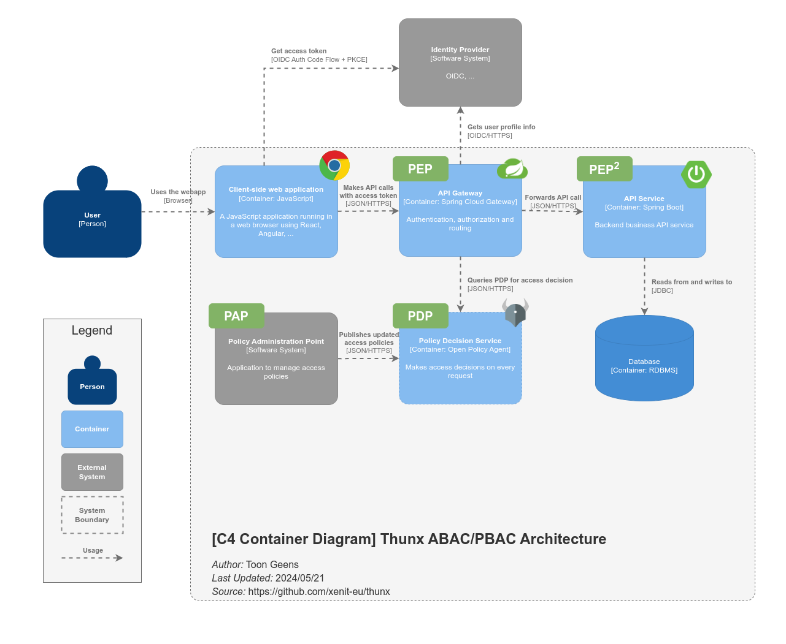

# Thunx  

[](https://github.com/xenit-eu/thunx/actions/workflows/ci.yml)
[](https://search.maven.org/search?q=g:com.contentgrid.thunx)
[](LICENSE)

Thunx is a pluggable [Attribute Based Access Control] system, with and end-to-end implementation
using:
* [OpenPolicyAgent] as a policy engine
* [Spring Cloud Gateway] as a policy enforcement point 
* [Spring Data REST] as an API service

This project uses a distributed authorization architecture, by applying:
* early access decisions at the API Gateway 
* postponed access decisions in the Spring Data REST service

When the API Gateway does not have sufficient contextual information to grant or deny access,
it delegates the policy decision to the Spring Data REST service. This API Service receives an
authorization-predicate, a __thunk__ from the API Gateway and rewrites the database queries to
ensure the authorization-predicate is satisfied.

### Advantages

This approach provides the following advantages:

* **Decoupling**: The API service does not need to be concerned with authorization logic.
* **Performance**: Using query-rewriting instead of post-filtering can be orders of magnitude faster.
* **Performance**: By delegating decisions to the appropriate data-context, access policies can be much more
  fine-grained, without paying a big runtime penalty for loading data in the policy engine on demand.

[Attribute Based Access Control]: https://en.wikipedia.org/wiki/Attribute-based_access_control
[OpenPolicyAgent]: https://www.openpolicyagent.org/
[Spring Cloud Gateway]: https://spring.io/projects/spring-cloud-gateway
[Spring Data REST]: https://spring.io/projects/spring-data-rest
[QueryDSL]: http://www.querydsl.com/

## Architecture overview

This section describes the Thunx architecture.

Please note all the diagrams use the [C4 model] style. A legend, included in every diagram, explains the meaning
of each shape.

A _Client-side webapp_ uses a REST API provided by the _API Service_. An API Gateway sits in between,
which takes care of authentication and authorization concerns.

The _Client-side webapp_ gets an access token with an OIDC Identity Provider and makes some REST API requests with the
access token. The API Gateway first validates the access token (authentication step). The user-profile is (optionally) 
loaded from the OIDC User Endpoint. The Gateway asks the Policy Decision Point (PDP) to authorize the request.

In a simple ABAC system, the authorization requests has a binary response: the policy engine returns an
_access granted_ or _access denied_ decision. The API Gateway adheres to this decision and either allows or denies
the request, acting as a classic Policy Enforcement Point (PEP).

Our system also allows for a _conditional and partial grant_. When the policy engine determines it does not have
sufficient information to make a decision, it returns a residual policy, a predicate. Access to the API resource 
is conditionally granted, if and only if, the predicated can be fulfilled when the missing information is available.

The residual policy, in this case an [OpenPolicyAgent] `QuerySet`, is translated into a technology-neutral boolean
expression, called a `thunk-expression`. The `thunk-expression` is stored as a `thunk-context` in the API Gateway
request context. The API Gateway forwards requests to the API Service and propagates the `thunk-context` by
serializing and encoding the `thunk-context` as HTTP request headers.

The API Service receives the REST API request. A filter reconstructs the `thunk-context` from the HTTP request headers.
The `thunk-expression` from the `thunk-context` can be converted into a [QueryDSL] predicate. When the API service
uses a JPA Repository, the [Spring Data QueryDSL Extension] can be used to include the QueryDSL predicate, and with
that fulfill the conditional authorization predicate.



[C4 model]: https://c4model.com/

[Spring Data QueryDSL Extension]: https://docs.spring.io/spring-data/jpa/docs/current/reference/html/#core.extensions.querydsl]

### Solution mechanics

#### Gateway

#### Spring Data REST

### Subprojects

This repository has several modules:

* `thunx-model` is a set of (vendor-neutral) data structures to model authorization policy expressions
* `thunx-pdp` is a central abstraction for a Policy Decision Point (PDP)
* `thunx-pdp-opa` is a PDP implementation using [OpenPolicyAgent](https://www.openpolicyagent.org/).
* `thunx-encoding-json` is a JSON-serialization library for thunk-expressions
* `thunx-predicates-querydsl` is a library to convert thunk-expressions into QueryDSL predicates
* `thunx-spring-api` provides an integration with Spring Data REST
* `thunx-spring-gateway` provides an integration with Spring Cloud Gateway
* `thunx-spring-querydsl-predicate-resolver` is a library to inject additional [QueryDSL] predicates to be processed
  together with the predicates from the [Spring Data QueryDSL Extension]

## Getting Started

### Installation

Requirements:

* Java 17+

#### Spring Cloud Gateway

Using Gradle:

```groovy
implementation "com.contentgrid.thunx:thunx-gateway-spring-boot-starter:${thunxVersion}"
```

#### Spring Data REST Service

Using Gradle:

```groovy
implementation "com.contentgrid.thunx:thunx-gateway-spring-boot-starter:${thunxVersion}"

implementation "com.querydsl:querydsl-jpa" // Or another QueryDSL implementation, dependent on the spring data flavor you're using
```


## License

Apache License Version 2.0
